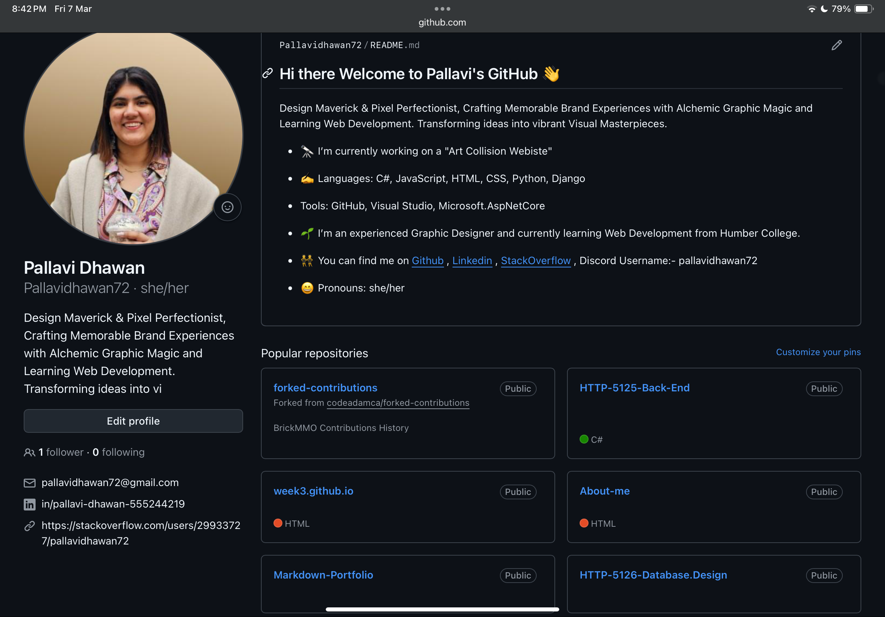

# Backend Web Development
This repository shows my projects/assignments of Backend in my course

## Information
In this course, I learnedabout Backend C#. Key topics covered includes:- 

- The server-side of web applications is the main focus of back-end development.  To make sure that everything functions properly
behind the scenes, it entails working with databases, server logic, and APIs.  Languages like **Python**, **Java**, **Node.js**,
and **PHP** are used by back-end developers to manage user authentication, process data, and connect to databases (such as MySQL and MongoDB).
The back-end guarantees the safe and effective delivery of the functionality and data required by the front-end, or user-facing portion.

## My Repository

## Links
You can find my GitHub Link Here[GitHub](https://github.com/Pallavidhawan72)
